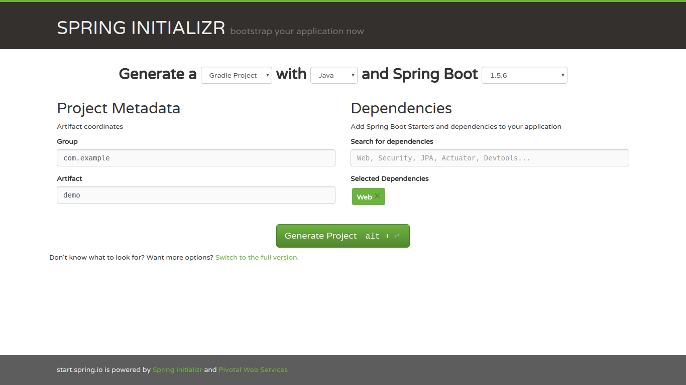

# SpringBootDemo
*本项目将展示如何创建最简单的SpringBoot Web应用*

## 简单介绍
- SpringBoot
- Web应用 & Java EE

## 创建过程
### 创建项目文件
用浏览器访问网站https://start.spring.io/，然后按下图填好内容：
，点击`Generate Project`按钮，将使用这个网站的服务生成一个SpringBoot项目（注意Dependencies输入选择`Web`），浏览器会下载一个demo.zip文件。解压后重命名目录为SpringBootDemo。

*你也可以使用curl等命令从终端直接下载项目文件*

### 创建一个`Hello World` HTTP响应.
在`src/main/java/com/example/demo`目录下创建`HelloController.java`文件，内容如下：
``` java
package com.example.demo;

import org.springframework.stereotype.Controller;
import org.springframework.web.bind.annotation.RequestMapping;

@Controller
public class HelloController {
	@RequestMapping("/")
	public String hello() {
		return "Hello World!";
	}

}
```

## 运行
Windows下双击项目根目录下的`gradlew.bat`运行，Linux下在根路径执行`./gradlew`程序运行。

然后用浏览器访问 http://localhost:8080，便可以看到`Hello World!`消息。
